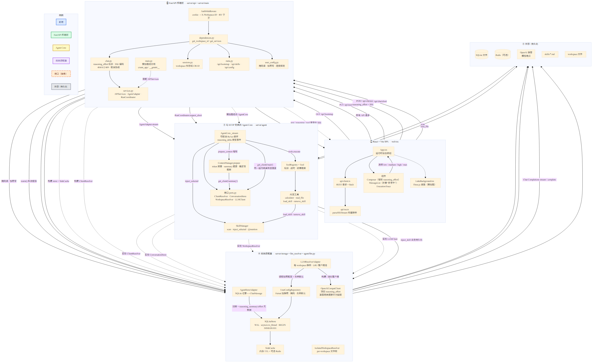

# Blue Lake Agent

[中文说明](readme_zh.md) · [Architecture source](docs/architecture.mmd) · [Deployment guide](deploy/DEPLOY.md)

Blue Lake Agent is a self-hosted, single-process chat application for an LLM that can use tools. It combines a React/Vite SPA with a FastAPI backend, a framework-independent ReAct Agent core, SQLite persistence, file-based Skills, and OpenAI-compatible model endpoints.

It is designed for a trusted private environment: each browser receives a stable workspace identity, and each workspace can save its own encrypted model configuration. It is not an internet-facing multi-tenant authentication system.

## What it provides

- **Per-turn reasoning effort.** The composer exposes `low`, `medium`, `high`, and `max`; the last choice is remembered locally and sent to every `main` call in that ReAct run.
- **Streaming Agent chat.** A cancellable ReAct loop streams typed SSE events for text, optional reasoning summaries, tool calls, tool results, errors, and completion.
- **Persistent conversations.** Create, restore, rename, and delete sessions; messages, tool traces, and loaded Skills are stored in SQLite.
- **Workspace-scoped state.** A `workspace_id` HttpOnly cookie keeps a browser's sessions and saved model configuration stable across reloads.
- **Encrypted provider settings.** The Settings panel saves `main` and optional `summary` provider details with Fernet encryption; API keys are only returned to the browser in masked form.
- **Skills and tools.** Trusted Markdown Skills can be selected in the UI, mentioned with `@skill-name`, or managed by tools. The built-ins are `calculator`, workspace-confined `read_file`, `load_skill`, and `remove_skill`.
- **Bounded execution.** Agent turns, consecutive tool failures, tool timeouts, tool-output size, and context size are configurable limits.
- **Responsive chat UI.** The frontend shows a compact, collapsed `Thinking` row instead of exposing reasoning inline; compatible plaintext summaries can be expanded, while tool traces remain separate.
- **Durable local storage.** SQLite is the source of truth. Redis is optional and used only as a best-effort side cache; an in-memory TTL cache is always available.

## Architecture



The diagram above is generated from [`docs/architecture.mmd`](docs/architecture.mmd). The code is organized into five boundaries:

| Boundary | Main location | Responsibility |
| --- | --- | --- |
| SPA | `web/src` | UI state, REST calls, `fetch()`-based SSE parsing, settings, and presentation |
| API / composition | `server/main.py`, `server/api` | FastAPI routes, workspace middleware, SSE transport, session CRUD, run coordination |
| Agent Core | `server/agent` | HTTP-independent ReAct loop, context preparation, Skills, tools, and typed events |
| Adapters | `server/storage`, `server/llm_resolver.py`, `server/agent/llm.py` | SQLite, cache, encrypted user config, workspace files, OpenAI-compatible client |
| External state | `data/`, `skills/`, model endpoint, optional Redis | Persistent data, trusted instructions, models, and optional cache |

The important dependency rule is: **the Agent Core depends on ports, not FastAPI, SQLite, or the OpenAI SDK.** `server/main.py` is the composition root that supplies the actual adapters.

### Request lifecycle

1. The SPA calls `GET /api/bootstrap`; the server reuses or creates an HttpOnly `workspace_id` cookie.
2. The SPA loads sessions, Skills, public limits, and masked user configuration. Private API requests are then scoped to that workspace by `AuthMiddleware`.
3. A message and its `reasoning_effort` go to `POST /api/chat`. The API accepts exactly `low`, `medium`, `high`, or `max`, allows one active run per workspace/session, then opens an SSE stream.
4. `AgentCore` applies that effort unchanged to every `main` model call in the run. The separate `summary` role does not inherit it.
5. Text, best-effort plaintext reasoning summaries, and tool events flow back as typed SSE. The assistant answer and reasoning metadata are persisted under one request id so history restores as one turn.

### Context and model roles

- `main` is required for chat. It is the model used for streaming responses and tool calls.
- `summary` is optional. It is used for context compression and first-message titles when its configuration is complete. If it fails or is unavailable, chat remains available: title generation falls back to the first prompt and context compression falls back to deterministic trimming.
- `reasoning_effort` is sent as a top-level Chat Completions parameter with no model-specific remapping or silent fallback. Unsupported model/effort pairs surface through the normal error path.
- Chat Completions has no official reasoning-summary contract. The adapter only forwards direct plaintext from compatible gateway fields (`reasoning_content`, `reasoning`, or `thinking`) and ignores structured/opaque payloads.
- `ContextManager` estimates mixed Chinese/English tokens, preserves recent messages and Skill injections, and keeps an assistant tool call with its tool replies as one atomic group.

### Skills and tool safety

Skills are Markdown files under `<workspace root>/skills` (the repository's default is [`skills/`](skills/)). They must include front matter:

```markdown
---
name: concise_plan
description: Turn a broad goal into a small executable plan.
---

Trusted instructions for the model go here.
```

Loaded Skills are persisted and deduplicated per conversation. `read_file` resolves paths inside the active workspace root and limits file size; it is an application-level guard, not an operating-system sandbox.

## Repository map

```text
server/
  api/                 FastAPI routes, request schemas, middleware, service adapters
  agent/               ReAct core, ports, context manager, Skills, tools, LLM adapter
  storage/             SQLite, cache, encrypted configuration, workspace resolver
  main.py              Lazy composition root and optional SPA hosting
web/
  src/                 React application, API client/SSE parser, components, visual scene
  public/fonts/        Bundled LXGW WenKai Lite font and its license information
skills/                Trusted Markdown Skill catalogue
tests/                 Python unit/integration tests
deploy/                Ubuntu + nginx + systemd deployment templates and guide
docs/architecture.mmd  Canonical Mermaid architecture diagram
```

## Quick start (Windows development)

### Prerequisites

- Python 3.11+
- A current Node.js version compatible with Vite 8
- An OpenAI Chat Completions-compatible endpoint that supports streamed tool calls
- Redis only if you want the optional shared side cache

### 1. Install dependencies

```powershell
python -m venv .venv
.venv\Scripts\Activate.ps1
python -m pip install -r requirements-dev.txt

cd web
npm ci
cd ..
```

### 2. Start the backend

```powershell
start.bat
```

On first run, `start.bat` creates a local `.agent_secret_key` with a valid Fernet key when `AGENT_SECRET_KEY` is not set. It also sets `AGENT_COOKIE_SECURE=false` for local loopback HTTP and starts FastAPI at `http://127.0.0.1:8000`.

### 3. Start the frontend

```powershell
cd web
npm run dev
```

Open <http://127.0.0.1:5173>. Vite proxies `/api` to FastAPI on port 8000.

### 4. Configure a model

Open **Settings** and fill in `main` `base_url`, `api_key`, and `model`. Use **Test** before **Save**. A `summary` configuration can be added separately; it is not required to start chatting.

## Configuration

[`config.yaml`](config.yaml) contains the defaults. All relative paths resolve from the selected config file, and environment variables take precedence.

| Concern | Primary configuration |
| --- | --- |
| Config file | `AGENT_CONFIG` |
| Secret and identity | `AGENT_SECRET_KEY`, `AGENT_REQUIRE_USER_CONFIG`, `AGENT_COOKIE_SECURE` |
| Main / summary provider | `AGENT_MAIN_*`, `AGENT_SUMMARY_*` (`API_KEY`, `BASE_URL`, `MODEL`, `MAX_TOKENS`, `TIMEOUT_S`, `TEMPERATURE`) |
| Agent / context limits | `AGENT_MAX_TURNS`, `AGENT_MAX_TOOL_RETRIES`, `AGENT_TOOL_TIMEOUT_S`, `AGENT_TOOL_RESULT_MAX_CHARS`, `AGENT_TOKEN_BUDGET`, `AGENT_SUMMARY_TRIGGER_RATIO`, `AGENT_PRESERVE_RECENT_MESSAGES` |
| Storage and cache | `AGENT_SQLITE_PATH`, `REDIS_URL`, `AGENT_CACHE_TTL_S` |
| Server and SPA | `AGENT_HOST`, `AGENT_PORT`, `AGENT_CORS_ORIGINS`, `AGENT_STATIC_DIR` |
| Workspace | `AGENT_WORKSPACE_ID`, `AGENT_WORKSPACE_NAME`, `AGENT_WORKSPACE_ROOT` |
| Frontend API origin | `VITE_API_BASE_URL` |

The checked-in `config.yaml` sets `llm.require_user_config: true`. In that mode, the server deliberately refuses to start without a valid `AGENT_SECRET_KEY`, so saved API keys are never silently made unrecoverable.

## API surface

| Endpoint | Purpose |
| --- | --- |
| `GET /api/bootstrap` | Create or reuse browser workspace identity |
| `GET /api/sessions`, `POST /api/sessions` | List and create workspace sessions |
| `PATCH` / `DELETE /api/sessions/{id}` | Rename or delete a session |
| `GET /api/sessions/{id}/messages` | Restore stored message history |
| `GET /api/skills`, `GET /api/config` | Discover Skills and browser-safe runtime information |
| `GET` / `PUT /api/user/config` | Read masked and write encrypted model settings |
| `POST /api/user/config/test` | Probe submitted provider roles without saving them |
| `POST /api/chat` | Start SSE chat; body includes `reasoning_effort` (`low` / `medium` / `high` / `max`, default `medium`) |
| `POST /api/chat/abort` | Request cooperative cancellation of an active run |
| `GET /api/health` | Health check |

When `web/dist` exists, FastAPI can serve the built SPA and fall back to `index.html` for client routes. Missing `/api/*` routes remain JSON 404 responses rather than becoming the SPA HTML shell.

## Verification

```powershell
python -m pytest

cd web
npm test
npm run build
```

The test suite uses fake LLMs and adapters, so it does not require an API key, a live model endpoint, or Redis.

## Deployment and security boundary

For an Ubuntu deployment with nginx and systemd, start from [`deploy/DEPLOY.md`](deploy/DEPLOY.md). Build the SPA first, keep a fixed `AGENT_SECRET_KEY`, run the backend on loopback, and terminate TLS at nginx.

Before exposing this project beyond a trusted private environment, add real authentication and authorization, TLS, request-size and rate limits, and stronger process/file-system isolation. In particular:

- The `workspace_id` cookie and `X-Workspace-ID` scope data; they are **not** authentication or authorization.
- `AGENT_SECRET_KEY` encrypts stored API keys. Rotating or losing it makes existing encrypted keys unreadable.
- Files read by `read_file` and the contents of trusted Skills can be sent to the configured remote model endpoint. Keep secrets outside the workspace root and review Skills before enabling them.
- CORS is a browser policy, not access control. Set `AGENT_COOKIE_SECURE=true` for HTTPS deployments.
