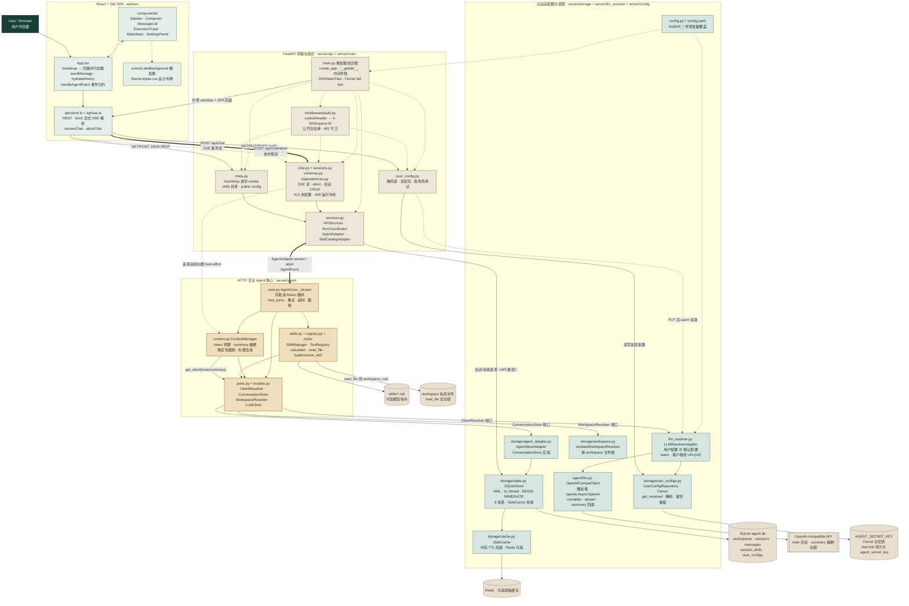

# Blue Lake Agent

Chinese README: [readme_zh.md](readme_zh.md)

Blue Lake Agent is a personal Agent chat application with streamed tool use, workspace-scoped conversation data, persistent sessions, and file-based Skills. It combines a FastAPI backend, a React/Vite SPA, SQLite persistence, a best-effort side cache, and an OpenAI-compatible model endpoint.

Each visitor gets a stable browser cookie identity, and every workspace can carry its own encrypted LLM configuration (main + summary roles) saved from the Settings panel — no shared API key is required.

After the frontend is built, FastAPI serves the SPA and API as one production deployment unit. Development intentionally runs Vite and FastAPI as two processes. The project is designed for trusted, private use; the cookie identity is a data-isolation boundary, not real authentication.

## Features

- **Streaming Agent runs:** a cancellable ReAct loop emits typed SSE events for model output, tool calls, results, errors, and completion.
- **Bounded execution:** total turns, consecutive tool failures, tool timeouts, and tool-result sizes are constrained; context compression falls back to deterministic truncation.
- **Persistent sessions:** create, restore, rename, and delete conversations; retain messages, execution traces, loaded Skills, and generated first-message titles.
- **Stable per-visitor identity:** `GET /api/bootstrap` issues (and reuses) an HttpOnly `workspace_id` cookie, so a saved config stays visible after a page reload. `AuthMiddleware` injects it as `X-Workspace-ID` and guards private API paths with 401 until an identity exists.
- **Per-workspace encrypted LLM config:** Settings panel stores `main` / `summary` provider configs (base_url, api_key, model) encrypted with Fernet under `AGENT_SECRET_KEY`; connection tests probe each role independently before saving.
- **File-based Skills:** load trusted Markdown instructions from the selector, an `@mention`, or the `load_skill` / `remove_skill` tools. Injection is persisted and deduplicated per session.
- **Built-in tools:** `calculator`, workspace-confined `read_file`, `load_skill`, and `remove_skill`.
- **Editorial Lakehouse UI:** responsive welcome and chat surfaces, GFM Markdown, highlighted code, collapsible execution traces, light/dark themes, a local LXGW WenKai Lite font, and a Three.js lake with reduced-motion fallback (lazy-loaded).
- **Durable storage:** SQLite is authoritative. `SideCache` always has an in-memory TTL cache and may use Redis as a best-effort primary; the default TTL is 24 hours.

## Architecture


| Layer | Responsibility |
| --- | --- |
| React + Vite SPA | Presentation components, `App.tsx` runtime state, REST requests, `fetch`-based SSE parsing, theme, and lake presentation |
| FastAPI transport and services | Session/meta routes, chat streaming, cooperative abort, run coordination, identity middleware, and dependency access |
| HTTP-independent Agent Core | ReAct orchestration, context policy, Skill semantics, tool validation/execution, and outbound ports |
| Outbound adapters | `AgentStoreAdapter`, `SQLiteStore`, side cache, OpenAI-compatible clients, Skill files, and workspace files |

The core follows a **hexagonal boundary**: API routes use `SQLiteStore` directly for session and metadata operations, while `AgentCore` persists through `ConversationStore → AgentStoreAdapter → SQLiteStore`.

See [the architecture notes](docs/architecture.md) for dependency rules, lifecycle, persistence, cancellation, and deliberate limits. The canonical diagram source is [`docs/architecture.mmd`](docs/architecture.mmd), with committed [SVG](docs/architecture.svg) and [PNG](docs/architecture.png) exports.

### Composition, identity, and per-user config

- **Lazy composition root.** `server/main.py` has no module-level `app` binding; `uvicorn server.main:app` resolves through a module `__getattr__` and builds the app only on first access. With `llm.require_user_config=true` (the shipped default), a missing or malformed `AGENT_SECRET_KEY` fails fast at startup instead of 500ing on the first encryption.
- **Cookie identity.** `GET /api/bootstrap` mints a per-visitor `workspace_id` (UUID) as an HttpOnly, SameSite=Lax cookie — or reuses the one already presented, keeping the identity stable across reloads and tabs. `AuthMiddleware` reads the cookie (or an explicit `X-Workspace-ID` header) and injects it for downstream workspace-scoped dependencies. Public endpoints (`/api/bootstrap`, `/api/health`, `OPTIONS` preflights, `/api/user/config/test`, and the SPA itself) stay reachable before any identity exists; everything else returns 401.
- **Encrypted per-workspace LLM config.** `/api/user/config` reads masked values and writes encrypted ones (Fernet, keyed by `AGENT_SECRET_KEY` / `.agent_secret_key`) into a per-workspace `user_configs` table. `PUT` invalidates the resolver cache; `POST /api/user/config/test` probes the `main` and `summary` roles independently with one tiny completion each, overlaying the submitted key and falling back to stored/default values — so a summary-only setup can be tested without configuring the main model.
- **Per-workspace client pool.** `LLMResolverAdapter` merges the user config with `llm.*` defaults, resolves it once per request (`warm`), and pools `OpenAICompatClient` instances by `(base_url, api_key, model)` with an LRU cap. The Agent Core only sees the sync `ClientResolver` port.
- **Two model roles.** `main` drives conversations; `summary` handles summarization, context compression, and title generation, falling back to `main` when unset.
- **SPA fallback with JSON 404.** `SPAStaticFiles` serves Vite assets and falls back to `index.html` for client-side routes, but `/api/*` misses always surface as JSON 404 — never as an HTML shell the frontend would fail to parse.

## Quick start

Prerequisites:

- Windows 10/11 (the bundled launcher is `start.bat`), Python 3.11+, Node.js 20.19+ or 22.12+
- An OpenAI-compatible Chat Completions endpoint that supports streamed tool calls
- Redis only if you want the optional shared side cache

### 1. Install

```powershell
python -m venv .venv
.venv\Scripts\Activate.ps1
python -m pip install -r requirements-dev.txt

cd web
npm ci
cd ..
```

### 2. Recommended: one-click dev start (`start.bat`)

`start.bat` is the recommended way to run the backend on Windows. It:

- uses `.venv\Scripts\python.exe` explicitly and auto-installs missing dependencies from `requirements.txt`;
- reuses `.agent_secret_key` when present, otherwise generates one and persists it — so user API keys survive restarts;
- sets `AGENT_COOKIE_SECURE=false` (a Secure cookie would be dropped by stricter browsers over plain loopback http);
- starts `uvicorn server.main:app --reload --port 8000`.

```powershell
start.bat
```

### 3. Run the frontend (development)

```powershell
cd web
npm run dev
```

Open <http://127.0.0.1:5173>. Vite proxies `/api` to FastAPI on port 8000.

### 4. Configure your model in the UI

Open the Settings panel and fill in at least the **main** role (base_url, api_key, model); the **summary** role is optional and falls back to main. Click **Test** — `/api/user/config/test` probes each configured role independently — then **Save**. Your keys are encrypted at rest; refresh the page and the config is still there.

### Manual backend start (alternative to `start.bat`)

```powershell
# Generate a valid Fernet key once, or export AGENT_SECRET_KEY
python -c "from cryptography.fernet import Fernet; print(Fernet.generate_key().decode())"

$env:AGENT_SECRET_KEY = "paste-the-32-byte-urlsafe-base64-key"
uvicorn server.main:app --reload --port 8000
```

> With the shipped `config.yaml` (`llm.require_user_config=true`), a missing or malformed `AGENT_SECRET_KEY` makes the server fail fast at startup on purpose.

### Production-style local run

Build the SPA first. FastAPI serves `web/dist` when it exists:

```powershell
cd web
npm run build
cd ..
uvicorn server.main:app --host 127.0.0.1 --port 8000
```

Open <http://127.0.0.1:8000>. Keep the loopback bind unless you have added the deployment controls listed under [Safety and deployment](#safety-and-deployment).

## Configuration

[`config.yaml`](config.yaml) provides defaults. Environment variables override YAML values. Relative database, static, and workspace paths are resolved from the selected configuration file.

| Area | Environment overrides |
| --- | --- |
| Config file | `AGENT_CONFIG` |
| Secrets / identity | `AGENT_SECRET_KEY` (Fernet key for user API keys), `AGENT_REQUIRE_USER_CONFIG`, `AGENT_COOKIE_SECURE` |
| Main / summary provider | Prefix `AGENT_MAIN_` or `AGENT_SUMMARY_`, then `API_KEY`, `BASE_URL`, `MODEL`, `MAX_TOKENS`, `TIMEOUT_S`, or `TEMPERATURE` |
| Agent / context | `AGENT_MAX_TURNS`, `AGENT_MAX_TOOL_RETRIES`, `AGENT_TOOL_TIMEOUT_S`, `AGENT_TOOL_RESULT_MAX_CHARS`, `AGENT_TOKEN_BUDGET`, `AGENT_SUMMARY_TRIGGER_RATIO`, `AGENT_PRESERVE_RECENT_MESSAGES` |
| Storage / cache | `AGENT_SQLITE_PATH`, `REDIS_URL`, `AGENT_CACHE_TTL_S` |
| Server | `AGENT_HOST`, `AGENT_PORT`, `AGENT_CORS_ORIGINS`, `AGENT_STATIC_DIR` |
| Workspace | `AGENT_WORKSPACE_ID`, `AGENT_WORKSPACE_NAME`, `AGENT_WORKSPACE_ROOT` |
| Frontend API origin | `VITE_API_BASE_URL` |

`llm.summary` is optional. Summary, compression, and title tasks reuse `llm.main` when a dedicated summary provider is absent. When `llm.require_user_config` is true, the `llm.main` block is only a fallback: each visitor configures their own API key in Settings.

## Skills

Skills are Markdown files under `<workspace.root>/skills`. With the default configuration, that is the repository [`skills/`](skills/) directory.

```markdown
---
name: concise_plan
description: Turn a broad goal into a small executable plan.
---

Your trusted Skill instructions go here.
```

A Skill can be loaded through `@concise_plan`, the UI selector, or the Agent's `load_skill` meta-tool. Treat Skill files as trusted model instructions; review them before making them available to the Agent.

## Project structure and architecture

The complete module dependency graph (canonical source: [`docs/architecture.mmd`](docs/architecture.mmd), exports: [`docs/architecture.svg`](docs/architecture.svg) / [`docs/architecture.png`](docs/architecture.png)):



### Module responsibilities and dependency chains

- **React + Vite SPA (`web/src`)** — `App.tsx` is the runtime state hub: it mints the workspace identity via `GET /api/bootstrap`, loads sessions/skills/config/user-config in parallel, restores the remembered session, and streams chat through `client.streamChat` + the incremental SSE parser in `api/sse.ts`. `SettingsPanel` saves per-workspace LLM config; a blank API key keeps the stored key server-side.
- **FastAPI transport (`server/api` + `server/main`)** — `main.py` is a lazy composition root; `AuthMiddleware` turns cookie/header identity into `X-Workspace-ID`; `chat.py` frames every Agent event as a named SSE frame and coordinates cancellation through `RunCoordinator` + `AgentAdapter` (404 session / 412 not configured / 409 run conflict); `sessions.py` is workspace-scoped CRUD over `SQLiteStore`; `user_config.py` masks reads, encrypts writes, and probes each role independently.
- **HTTP-independent Agent Core (`server/agent`)** — `AgentCore._stream` is the cancellable ReAct loop: validate session → inject selected Skills → persist the user message → per-turn `ContextManager.prepare` (token budget, summary role, deterministic truncation) → streaming main-model turn → execute tools under timeout/size/retry bounds → persist results → emit typed events. It depends only on the ports in `ports.py` (`ClientResolver`, `ConversationStore`, `WorkspaceResolver`, `LLMClient`) — no FastAPI, no database.
- **Outbound adapters (`server/storage`, `server/llm_resolver`, `server/agent/llm.py`)** — `AgentStoreAdapter` implements the `ConversationStore` port over `SQLiteStore` (WAL, `asyncio.to_thread`, `BEGIN IMMEDIATE`, side-cache invalidation); `LLMResolverAdapter` implements `ClientResolver` by merging the per-workspace encrypted user config with `config.yaml` defaults and pooling `OpenAICompatClient` instances by `(base_url, api_key, model)`; `IsolatedWorkspaceResolver` gives each workspace a private file root for `read_file`.

Key dependency chains:

1. **Chat:** `App.tsx` → `POST /api/chat` (SSE) → `chat.py` (404/412/409 guards) → `AgentAdapter.stream` → `AgentCore._stream` → `ContextManager.prepare` → `ClientResolver.get_client("main", workspace_id)` → `OpenAICompatClient.stream` → remote model; events flow back as typed SSE frames → `parseSSEStream` → `handleAgentEvent`.
2. **Persistence:** Agent Core reaches SQLite only via `ConversationStore → AgentStoreAdapter → SQLiteStore`; API routes reach `SQLiteStore` directly. Every write invalidates the related `SideCache` keys (in-memory TTL always available, Redis optional).
3. **Identity / config:** `GET /api/bootstrap` cookie → `AuthMiddleware` → `X-Workspace-ID` → `dependencies.get_workspace_id` → workspace scoping of DB rows, file root, and encrypted `user_configs`; `PUT /api/user/config` invalidates the resolver cache.
4. **Skills:** `skills/*.md` → `SkillManager.scan` → UI selector / `@mention` / `load_skill` tool → persisted, deduplicated per-session injection.
5. **Cancellation:** browser `AbortController` + `POST /api/chat/abort` → `RunCoordinator.request_abort` + `AgentCore.abort` → cooperative `AgentRunCancelled` → terminal `done(finish_reason=aborted)`.

## Verification

```powershell
python -m pytest

cd web
npm test
npm run build
```

The automated tests use fake LLM and repository adapters; they do not require an API key, Redis server, or network access.

## Safety and deployment

- There is no real authentication, authorization, TLS, or rate limiting. CORS is browser policy, not access control. The `workspace_id` cookie is a data-isolation boundary (each workspace gets its own sessions, files, and encrypted config), not a security boundary.
- `AGENT_SECRET_KEY` encrypts user API keys at rest. It is never committed; `.agent_secret_key` (generated by `start.bat`) is git-ignored. Losing the key makes stored keys unreadable.
- `X-Workspace-ID` scopes database operations; it is not an identity boundary. The current resolver maps workspace IDs to one configured filesystem root.
- `read_file` rejects paths outside `AGENT_WORKSPACE_ROOT` and limits file size, but this is an application guard rather than an operating-system sandbox.
- Tool-read file contents may be sent to the configured remote model. Keep secrets outside the workspace root.
- Skills can change model behavior and must be treated as trusted input.
- Before any public deployment, add a protected reverse proxy, TLS, real authentication, request-size/rate limits, and stronger process/filesystem isolation. In production set `AGENT_COOKIE_SECURE=true` (the cookie is then only sent over HTTPS).

The bundled font files and their license/source notes remain under [`web/public/fonts/`](web/public/fonts/); the UI does not depend on a font CDN.
