# Blue Lake Agent

English README: [README.md](README.md)

Blue Lake Agent 是一个面向个人使用的 Agent 聊天应用，支持流式工具调用、按 workspace 划分的会话数据、持久化会话，以及基于文件的 Skills。项目由 FastAPI 后端、React/Vite SPA、SQLite 持久化、尽力而为的旁路缓存和兼容 OpenAI 的模型端点组成。

前端构建完成后，FastAPI 会同时托管 SPA 和 API，形成一个生产部署单元。开发阶段则有意让 Vite 与 FastAPI 作为两个进程运行。项目面向可信、私有环境，目前不包含身份认证。

## 功能

- **流式 Agent 执行：** 可中断的 ReAct 循环通过类型化 SSE 事件持续返回模型输出、工具调用、结果、错误和完成状态。
- **有界执行：** 限制总轮次、连续工具失败次数、工具超时和结果大小；上下文压缩失败时会回退到确定性截断。
- **持久化会话：** 支持创建、恢复、重命名和删除会话，并保留消息、执行轨迹、已加载 Skills 和根据首条消息生成的标题。
- **文件式 Skills：** 可以通过 UI 选择器、`@mention`，或 `load_skill` / `remove_skill` 工具加载可信 Markdown 指令。注入记录会持久化，并在每个会话内去重。
- **内置工具：** `calculator`、限制在 workspace 内的 `read_file`、`load_skill` 和 `remove_skill`。
- **Editorial Lakehouse 界面：** 响应式欢迎页与聊天界面、GFM Markdown、代码高亮、可折叠执行轨迹、明暗主题、本地 LXGW WenKai Lite 字体，以及带 reduced-motion fallback 的 Three.js 湖面。
- **可靠存储：** SQLite 是事实数据源。`SideCache` 始终包含内存 TTL 缓存，并可把 Redis 作为尽力而为的主缓存；默认 TTL 为 24 小时。

## 架构



| 层 | 职责 |
| --- | --- |
| React + Vite SPA | 展示组件、`App.tsx` 运行时状态、REST 请求、基于 `fetch` 的 SSE 解析、主题与湖面视觉 |
| FastAPI 传输与应用服务 | 会话/元数据路由、聊天流、协作式中断、运行协调与依赖访问 |
| 与 HTTP 无关的 Agent Core | ReAct 编排、上下文策略、Skill 语义、工具校验/执行与出站端口 |
| 出站适配器 | `AgentStoreAdapter`、`SQLiteStore`、旁路缓存、OpenAI-compatible clients、Skill 文件和 workspace 文件 |

核心采用**六边形架构边界**：API 路由在会话和元数据操作中直接使用 `SQLiteStore`，而 `AgentCore` 的持久化路径是 `ConversationStore → AgentStoreAdapter → SQLiteStore`。

依赖规则、请求生命周期、持久化、取消和有意保留的限制见[架构说明](docs/architecture.md)。架构图的规范源文件是 [`docs/architecture.mmd`](docs/architecture.mmd)，仓库同时提交了 [SVG](docs/architecture.svg) 与 [PNG](docs/architecture.png) 导出文件。

## 快速开始

前置要求：

- Python 3.11+
- Node.js 20.19+ 或 22.12+
- 一个兼容 OpenAI Chat Completions、支持 streamed tool calls 的端点
- 仅在需要可选共享旁路缓存时准备 Redis

### 1. 安装

```powershell
python -m venv .venv
.venv\Scripts\Activate.ps1
python -m pip install -r requirements-dev.txt

cd web
npm ci
cd ..
```

### 2. 配置模型

请在即将启动 FastAPI 的 shell 中设置环境变量：

```powershell
$env:AGENT_MAIN_API_KEY = "replace-with-your-key"

# 可选的 provider 覆盖项
$env:AGENT_MAIN_BASE_URL = "https://api.openai.com/v1"
$env:AGENT_MAIN_MODEL = "gpt-4.1-mini"
```

[`.env.example`](.env.example) 仅用于参考，应用不会自动加载 `.env` 文件。你也可以直接编辑 [`config.yaml`](config.yaml)，但不要提交 secrets。

### 3. 开发模式运行

```powershell
# terminal 1, repository root
uvicorn server.main:app --reload --port 8000

# terminal 2
cd web
npm run dev
```

打开 <http://127.0.0.1:5173>。Vite 会把 `/api` 代理到 FastAPI。

### 接近生产环境的本地运行

先构建 SPA。只要 `web/dist` 存在，FastAPI 就会直接托管它：

```powershell
cd web
npm run build
cd ..
uvicorn server.main:app --host 127.0.0.1 --port 8000
```

打开 <http://127.0.0.1:8000>。在完成[安全与部署](#安全与部署)列出的控制措施之前，请保持 loopback 地址绑定。

## 配置

[`config.yaml`](config.yaml) 提供默认值，环境变量会覆盖 YAML 配置。相对数据库、静态资源和 workspace 路径都基于所选配置文件的位置解析。

| 范围 | 环境变量覆盖项 |
| --- | --- |
| 配置文件 | `AGENT_CONFIG` |
| 主模型 / 摘要模型 | 使用 `AGENT_MAIN_` 或 `AGENT_SUMMARY_` 前缀，再接 `API_KEY`、`BASE_URL`、`MODEL`、`MAX_TOKENS`、`TIMEOUT_S` 或 `TEMPERATURE` |
| Agent / context | `AGENT_MAX_TURNS`、`AGENT_MAX_TOOL_RETRIES`、`AGENT_TOOL_TIMEOUT_S`、`AGENT_TOOL_RESULT_MAX_CHARS`、`AGENT_TOKEN_BUDGET`、`AGENT_SUMMARY_TRIGGER_RATIO`、`AGENT_PRESERVE_RECENT_MESSAGES` |
| 存储 / 缓存 | `AGENT_SQLITE_PATH`、`REDIS_URL`、`AGENT_CACHE_TTL_S` |
| 服务端 | `AGENT_HOST`、`AGENT_PORT`、`AGENT_CORS_ORIGINS`、`AGENT_STATIC_DIR` |
| Workspace | `AGENT_WORKSPACE_ID`、`AGENT_WORKSPACE_NAME`、`AGENT_WORKSPACE_ROOT` |
| 前端 API origin | `VITE_API_BASE_URL` |

`llm.summary` 是可选配置。没有单独的 summary provider 时，摘要、上下文压缩和标题任务会复用 `llm.main`。

## Skills

Skills 是 `<workspace.root>/skills` 下的 Markdown 文件。使用默认配置时，对应仓库中的 [`skills/`](skills/) 目录。

```markdown
---
name: concise_plan
description: Turn a broad goal into a small executable plan.
---

Your trusted Skill instructions go here.
```

Skill 可以通过 `@concise_plan`、UI 选择器或 Agent 的 `load_skill` meta-tool 加载。Skill 文件属于模型指令，在开放给 Agent 之前应视为可信输入并完成审查。

## 项目结构

```text
server/
  agent/       # 与框架无关的 Agent 策略、端口、上下文、工具和 Skills
  api/         # FastAPI 路由、SSE framing、适配器与运行协调
  storage/     # SQLite repository、AgentStoreAdapter、内存/Redis 旁路缓存
  config.py    # YAML 加载与显式环境变量覆盖
  main.py      # composition root 与生产 SPA 托管
web/src/
  api/         # REST client 与增量 SSE parser
  components/  # chat、Markdown、trace、sidebar、welcome、composer
  scene/       # 装饰性的 Three.js 湖面
  theme/       # Editorial Lakehouse 视觉系统
skills/        # 可信 Markdown Skill registry
docs/          # 架构源文件、导出图与设计说明
```

## 验证

```powershell
python -m pytest

cd web
npm test
npm run build
```

自动化测试使用 fake LLM 和 repository adapters，不需要 API key、Redis server 或网络访问。

## 安全与部署

- 项目没有身份认证、授权、TLS 或 rate limiting。CORS 是浏览器策略，不是访问控制。
- `X-Workspace-ID` 只限定数据库操作范围，不构成身份边界。当前 resolver 会把所有 workspace ID 映射到同一个配置的文件系统根目录。
- `read_file` 会拒绝 `AGENT_WORKSPACE_ROOT` 之外的路径并限制文件大小，但这只是应用层防护，不是操作系统 sandbox。
- 工具读取的文件内容可能被发送到配置的远程模型。请把 secrets 放在 workspace root 之外。
- Skills 可以改变模型行为，必须作为可信输入处理。
- 任何公共部署都应先增加受保护的 reverse proxy、TLS、身份认证、请求大小/速率限制，以及更强的进程与文件系统隔离。

内置字体文件及其 license/source 说明仍位于 [`web/public/fonts/`](web/public/fonts/)；UI 不依赖字体 CDN。
